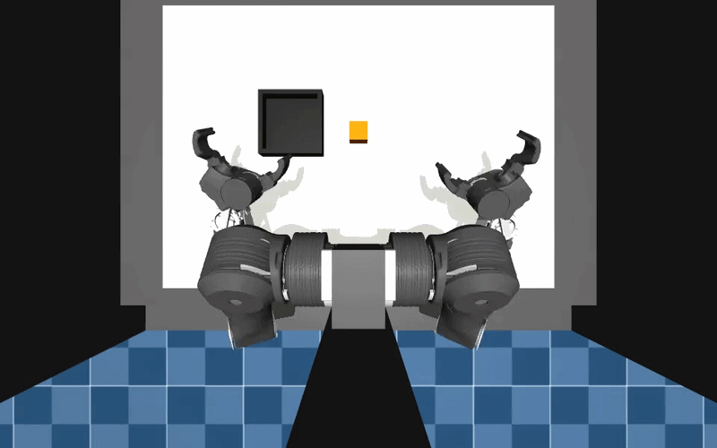

# gym-openarm

A gym environment for the OpenArm Cell.



## Installation

Create a virtual environment with Python 3.12 and activate it, e.g. with [`uv`](https://docs.astral.sh/uv/):

```bash
uv sync --extra lerobot     # environment + LeRobot (for lerobot-eval)
uv sync                     # environment only
```

MuJoCo renders offscreen, so pick a backend before running headless (see [GPU Rendering](#-gpu-rendering-egl)):

```bash
export MUJOCO_GL=egl        # GPU machines
export MUJOCO_GL=osmesa     # CPU only (needs libosmesa6)
```

## Quickstart

```python
# example.py
import imageio
import gymnasium as gym
import numpy as np
import gym_openarm

env = gym.make("gym_openarm/OpenArmPickCube-v0")
observation, info = env.reset()
frames = []

for _ in range(1000):
    action = env.action_space.sample()
    observation, reward, terminated, truncated, info = env.step(action)
    image = env.render()
    frames.append(image)

    if terminated or truncated:
        observation, info = env.reset()

env.close()
imageio.mimsave("example.mp4", np.stack(frames), fps=30)
```

## Evaluate a policy with LeRobot

The package follows the layout of [`gym-aloha`](https://github.com/huggingface/gym-aloha),
so `lerobot-eval` drives it exactly like `pusht` or `aloha`:

```bash
uv run lerobot-eval \
  --policy.path=enactic/act-openarm-2-cell-pick_up_cube_mujoco \
  --policy.device=cuda \
  --env.type=openarm \
  --env.discover_packages_path=gym_openarm \
  --eval.n_episodes=10 \
  --eval.batch_size=5
```

`--env.discover_packages_path` is LeRobot's plugin hook: it imports the package
so the `openarm` choice registers itself before the CLI is parsed.

## Description

OpenArm Cell pick-and-place, built to evaluate policies trained on
`enactic/openarm-2-cell-*-lerobot` datasets — no re-teleoperation required.

One task is available:

- PickCubeTask: pick up the orange cube lying on the table and set it down
  inside the black tray.

### Action Space

The action space consists of continuous joint-position targets for both arms,
resulting in a 16-dimensional vector ordered `right` joints 1–7, right gripper,
then `left` joints 1–7, left gripper — identical to the dataset's `action`.

Bounds are the actuators' control ranges (asymmetric per arm: right gripper
`[-0.785, 0]`, left gripper `[0, 0.785]`). Targets are applied to the MJCF's own
position actuators and simulated forward — not teleported into `qpos`.

### Observation Space

Observations are provided as a dictionary with the following keys:

- `pixels`: camera feeds from the cell cameras (`ceiling`, `head_left`,
  `head_right`, `wrist_left`, `wrist_right`) at their native MJCF resolutions.
- `agent_pos`: 16-dimensional joint vector in dataset order.

LeRobot's `preprocess_observation()` renames the keys itself: `agent_pos` →
`observation.state`, `pixels/<camera>` → `observation.images.<camera>`. The
mapping lives in `lerobot_config.OpenArmEnv.features_map`.

Compatibility with the dataset:

| | Dataset / policy | This env |
|---|---|---|
| scene | OpenArm Cell, orange cube | `gym_openarm/assets/cell/demo.xml`, vendored from `openarm_mujoco` v2 |
| `action` / `observation.state` | 16-d, `right` joints 1–7 + gripper, then `left` | identical order, see `constants.STATE_NAMES` |
| control rate | 30 Hz | 30 Hz (33 MuJoCo substeps of 1 ms) |
| cameras | `ceiling`, `head_left`, `head_right`, `wrist_left`, `wrist_right` | same names, native MJCF resolutions |

Rendering dominates the runtime; every extra camera costs a full offscreen pass
per step. Pass a subset via `--env.cameras='["head_left","wrist_left","wrist_right"]'`
or render smaller frames with `--env.observation_height`/`--env.observation_width`
if you want speed over fidelity.

### Rewards

- PickCubeTask:
  - 0.5 while the cube is held between two fingers.
  - 1.0 once the cube is set down inside the black tray.

### Success Criteria

The cube is set down inside the black tray: center within ±4 cm of the tray
middle, resting height, released by the gripper and (nearly) at rest — a
fly-through does not count.

Note: the published ACT policy was trained on lift-only demos, so it will move
and lift but not place — expect ~0 % success until you train on place demos.

### Starting State

Episodes start from the dataset start pose (`constants.RESET_ARM_POSE`, the mean
first frame of `enactic/openarm-2-cell-pick_up_cube_mujoco-lerobot`) — not the
MJCF `home` keyframe, which is a folded transport pose the policy never saw
during training. The cube always spawns at the same fixed pose (the MJCF table
center, no position/yaw randomization); re-enable randomization via the task's
`position_noise` / `randomize_yaw` arguments if needed.

### Arguments

```python
>>> import gymnasium as gym
>>> import gym_openarm
>>> env = gym.make("gym_openarm/OpenArmPickCube-v0", obs_type="pixels_agent_pos", render_mode="rgb_array")
>>> env
<TimeLimit<OrderEnforcing<PassiveEnvChecker<OpenArmEnv<gym_openarm/OpenArmPickCube-v0>>>>>
```

- `task`: (str) The task to load. Only `pick_cube` for now.
- `obs_type`: (str) The observation type. Can be either `pixels` or
  `pixels_agent_pos`. Default is `pixels_agent_pos`.
- `cameras`: (list) Cell cameras to render, named as in the dataset image keys.
  Default is all five.
- `observation_height`, `observation_width`: (int) Render size, or `None` for
  each camera's native resolution.
- `render_mode`: (str) Only `rgb_array` is supported for now.
- `render_camera`: (str) Camera used by `render()`. Default is `ceiling`.
- `visualization_height`: (int) Render height of `render()`. Default is `600`.
- `visualization_width`: (int) Render width of `render()`. Default is `960`.
- `task_kwargs`: (dict) Extra keyword arguments forwarded to the task.

### 🔧 GPU Rendering (EGL)

Rendering on the GPU can be significantly faster than CPU. Set `MUJOCO_GL=egl`
on GPU machines; on CPU-only machines use `MUJOCO_GL=osmesa` (needs the
`libosmesa6` system package). If rendering fails, check `MUJOCO_LOG.TXT` for
MuJoCo OpenGL errors.

## Contribute

Install the project with dev dependencies:

```bash
uv sync --extra lerobot --group dev
```

### Follow our style

```bash
# install pre-commit hooks
pre-commit install

# apply style and linter checks on staged files
pre-commit
```

Run the tests with:

```bash
uv run pytest
```

## Acknowledgment

Layout adapted from [`gym-aloha`](https://github.com/huggingface/gym-aloha).
Cell scene and meshes vendored from
[`openarm_mujoco`](https://github.com/enactic/openarm_mujoco) (Apache-2.0);
[`dataset`](https://huggingface.co/datasets/enactic/openarm-2-cell-pick_up_cube_mujoco-lerobot)
and [`ACT policy`](https://huggingface.co/enactic/act-openarm-2-cell-pick_up_cube_mujoco)
by Enactic.

## License

Apache-2.0, matching the upstream OpenArm repositories.
